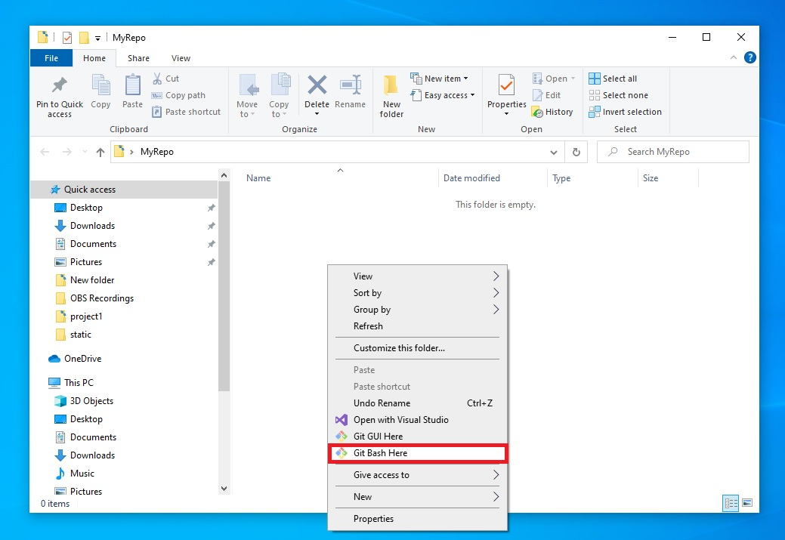
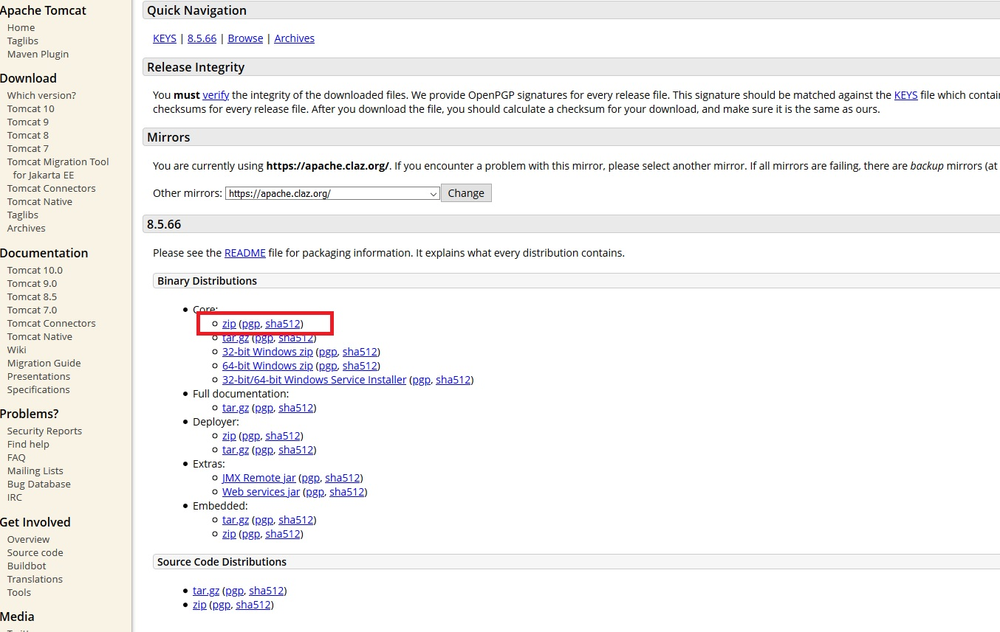
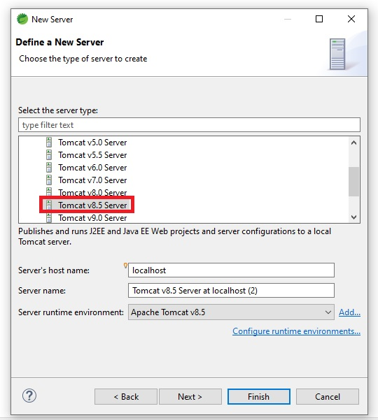
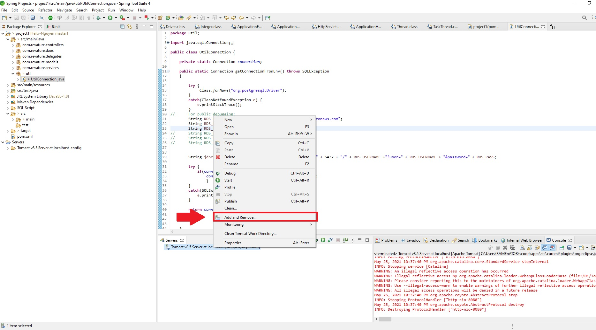
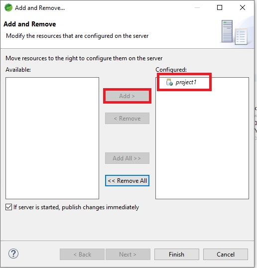
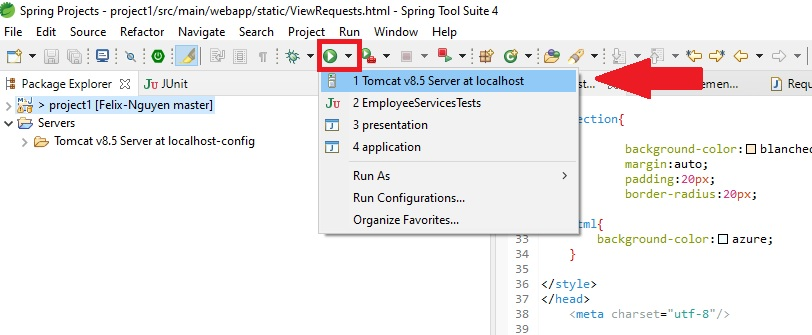
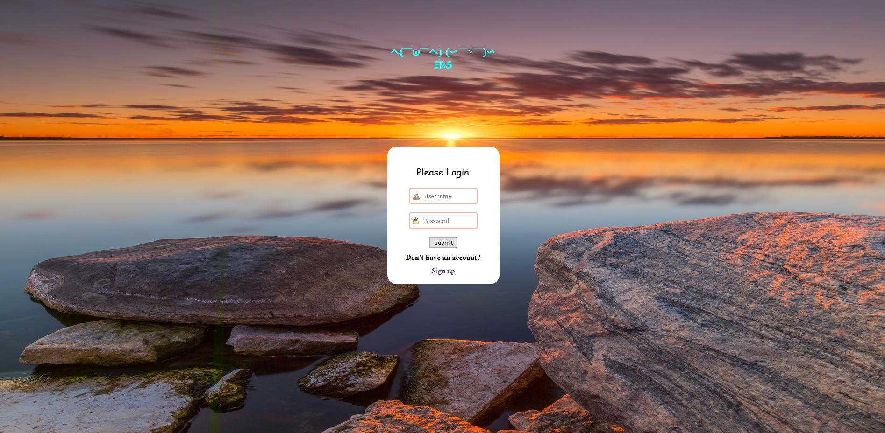

# Project-1: Employee Reimbursement System (ERS)

## Project Description

The ERS is a tool for employees to send and review reimbursement requests. Managers can login and review the requests for approval or rejection.

## Technologies Used

* Java
* JavaScript
* HTML
* CSS
* AJAX
* PostgreSQL
* AWS RDS
* Apache TomCat
* DBeaver
* Spring Tool Suite

## Features

List of features ready and TODOs for future development
#### Employee User Features
- An Employee can login
- An Employee can view the Employee Homepage
- An Employee can logout
- An Employee can submit a reimbursement request
- An Employee can upload an image of his/her receipt as part of the reimbursement request (extra credit)
- An Employee can view their pending reimbursement requests
- An Employee can view their resolved reimbursement requests
- An Employee can view their information
- An Employee can update their information
- An Employee receives an email when one of their reimbursement requests is resolved (optional)

#### Manager User Features
- A Manager can login
- A Manager can view the Manager Homepage
- A Manager can logout
- A Manager can approve/deny pending reimbursement requests
- A Manager can view all pending requests from all employees
- A Manager can view images of the receipts from reimbursement requests (extra credit)
- A Manager can view all resolved requests from all employees and see which manager resolved it
- A Manager can view all Employees
- A Manager can view reimbursement requests from a single Employee 

To-do list:
* The user can upload a receipt along with their request
* Manager will be able to view the receipt to check for valid information
* Enable user account creation on the login page

## Getting Started
#### Cloning a repository into your local storage
   1. Open ***Git Bash*** - if Git is not already installed, you can visit the link [here] (https://git-scm.com/downloads) and download the corresponding version for your operating system
   2. Go to the current directory where you want the cloned directory to be added
   3. Right click inside the folder and select ***Git Bash Here***

   

   4. Copy one of the following links
   - For HTTPS:
      -  https://github.com/210419-USF-BSN-Java/Felix-Nguyen.git
   - For SSH:		
   		- git@github.com:210419-USF-BSN-Java/Felix-Nguyen.git
   - For GitHub CLI 
      -  gh repo clone 210419-USF-BSN-Java/Felix-Nguyen

   
   5. Inside Git Bash, enter ***git clone*** plus your link and hit enter.  The repository will then be visible within your local folder.
  
        

   6. Open Eclipse or Spring Tool Suite 
   7. Select File - > Import - > Maven - > Existing Maven Projects.  
Select the project name you want to import, in this case project1.

8. In order for the project to run, it needs to be hosted an application server.  For my project I used Tomcat v8.5.

   Visit here to download Tomcat 8.5: https://tomcat.apache.org/download-80.cgi

   Under Core, install the zip file.

      

   9. To add a server into STS or Eclipse, select File - > New - > Other - > Server - > Tomcat v8.5 Server
   
      

      - Server host name: localhost
      - Server name: Tomcat v8.5 Server at localhost
      - Server runtime environment: Apache Tomcat v8.5.  

      Finish.

   10. Add the project to the server
      
       - Right click on the server - > Add and Remove - > select project1 - > Add - > Finish
         
           
            

## Usage

> Here, you instruct other people on how to use your project after they�ve installed it. This would also be a good place to include screenshots of your project in action.

Start up the application server (Tomcat) here

The console will start displaying start up data.

>Go into your browser and enter http://localhost:8080/project1/

This is the main login page for both employees and managers.

If setup is successful, the user will be introduced to this page

The credentials for an employee are
>Username: felix

>Password: nguyen

Upon logging in the employee will be directed to the home page.

The employee may select ***View Your Tickets*** to check any pending or reviewed requests updated by a manager.  Currently this employee has one ticket that was rejected.

We can submit a ticket through ***Submit a ticket*** 

After sending a ticket, we can view our recently created ticket by checking ***View Your Tickets*** again.

Additionally an employee may view their info through ***View Info***

Or update their information by clicking ***Update Info***

Selecting ***Log Out*** will return the employee back to the login page.

To log in as a manager use the following credentials:
>Username: ldadd3

>Password: NrSLHxr0VDQ

On successful login, the manager will be directed to the manager home page.

We can review employee requests by clicking on ***Accept/Reject Requests***. We can also see that our recent ticket was just added at the bottom.

To approve or reject the request, enter a reimbursement ID on the first column and choose from the drop down.  Click on submit to finalize.  Clicking on reset allows to view the changes.

Additionally we can filter employee requests by ***ID*** by entering in form and clicking submit.

Furthermore we can filter employee requests by ***status*** such as submitted, approved, and rejected.

Lastly, a manager can view all employees which also includes all managers.

## License

This project uses the following license: [MIT License](https://choosealicense.com/licenses/mit/).
MIT License

Copyright (c) [2021] [Felix-Tai Vi Nguyen]

Permission is hereby granted, free of charge, to any person obtaining a copy
of this software and associated documentation files (the "Software"), to deal
in the Software without restriction, including without limitation the rights
to use, copy, modify, merge, publish, distribute, sublicense, and/or sell
copies of the Software, and to permit persons to whom the Software is
furnished to do so, subject to the following conditions:

The above copyright notice and this permission notice shall be included in all
copies or substantial portions of the Software.

THE SOFTWARE IS PROVIDED "AS IS", WITHOUT WARRANTY OF ANY KIND, EXPRESS OR
IMPLIED, INCLUDING BUT NOT LIMITED TO THE WARRANTIES OF MERCHANTABILITY,
FITNESS FOR A PARTICULAR PURPOSE AND NONINFRINGEMENT. IN NO EVENT SHALL THE
AUTHORS OR COPYRIGHT HOLDERS BE LIABLE FOR ANY CLAIM, DAMAGES OR OTHER
LIABILITY, WHETHER IN AN ACTION OF CONTRACT, TORT OR OTHERWISE, ARISING FROM,
OUT OF OR IN CONNECTION WITH THE SOFTWARE OR THE USE OR OTHER DEALINGS IN THE
SOFTWARE.

